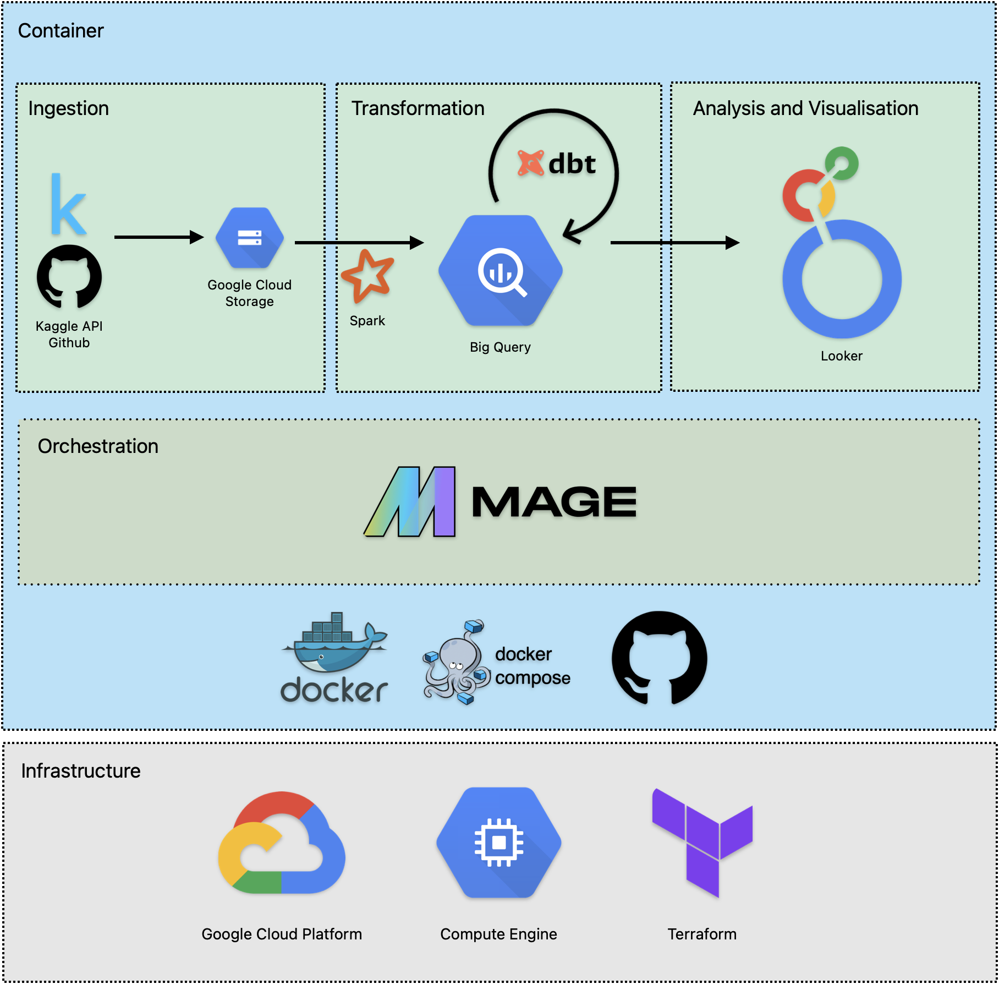

# e2e-data-pipeline

# Pre-requisites

```
Google Cloud SDK (467.0.0)
Anaconda (3)
Docker/docker-compose (2.26.0)
Terraform (1.7.5)
Spark (3.3.2)
Hadoop3 (2.2.5)
```


# Workflow



* Create Resources: GCP Project + Service Accounts + VM + Bucket/Dataset using IaC
* Load raw data (as csv) from Kaggle/Github and export to datalake/GCS bucket (as parquet) through Mage as orchestrators
* Process data using spark/python and store in data warehouse/BigQuery
* Perform data transformation inside BigQuery data warehouse using dbt cloud
* Cluster/partition data in data warehouse
* Visualise data using Looker