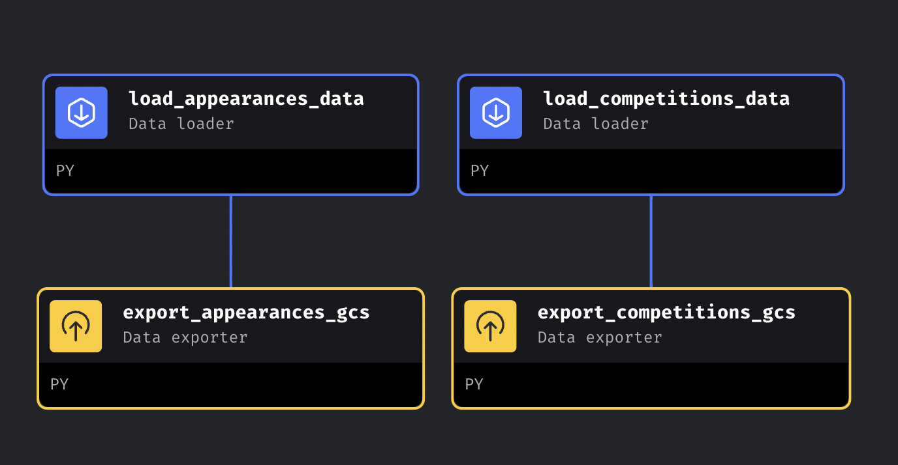

# Mage: Orchestrator

## Build and start Mage

**These instructions have been slightly modified from those of the [main project](https://github.com/mage-ai/mage-zoomcamp) to be self-sufficient within the context of our project.**

1. Clone the repo:

    ```bash
    git clone https://github.com/abhirup-ghosh/e2e-data-pipeline.git
    ```

2. Navigate to the orchestrator directory:

    ```bash
    cd e2e-data-pipeline/orchestrator-mage
    ```

3. Rename `dev.env` as `.env` — this will _ensure_ the file is not committed to Git by accident, since it _will_ contain credentials in the future.

    ```bash
    mv dev.env .env
    ```

4. Build and start the container

    ```bash
    docker-compose build
    docker-compose up
    ```

5. Navigate to http://localhost:6789 in your local macine browser (provided port 6789 had been already forwarded from VM to local machine using VS Code Remote-SSH)

## Build New Pipeline

We need to build a pipeline that loads raw data from the two csv files:
* appearances.csv
* competitions.csv
and exports them to our GCS bucket `capstone_datalake`. In order to do that, we follow these steps:

1. Build new pipeline by uploading the zip file `orchestrator-mage/etl_github_gcs_raw_data.zip`

2. Run@Once to load and export `appearances.csv` and `competitions.csv` to `capstone_datalake`.

The pipeline looks like this:

